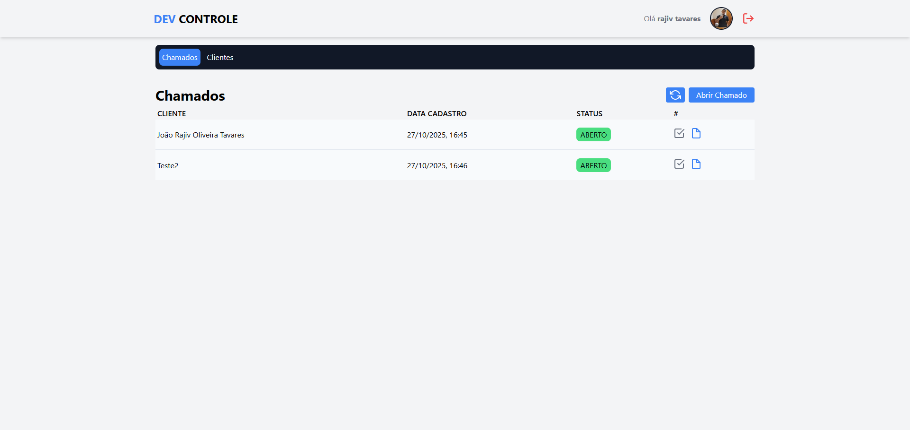
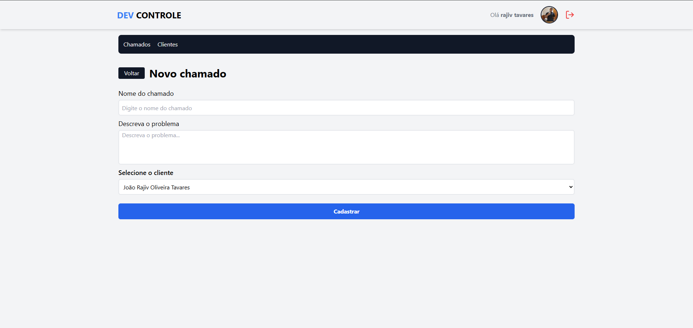

# 🚀 Projeto de Sistema de Chamados

Este é um sistema web full-stack para gerenciamento de chamados de suporte, permitindo que usuários autenticados gerenciem clientes e seus respectivos chamados. O projeto também conta com uma rota pública para que clientes possam abrir solicitações diretamente sem a necessidade de logar com o Google.


[](https://dev-controle-blue.vercel.app/)

## 📖 Índice

- [Visão Geral](#-visão-geral)
- [Funcionalidades Principais](#-funcionalidades-principais)
- [Tecnologias Utilizadas](#-tecnologias-utilizadas)
- [🖼️ Preview](#-preview) - [Tecnologias Utilizadas](#-tecnologias-utilizadas)
- [Como Executar o Projeto](#-como-executar-o-projeto)
  - [Pré-requisitos](#pré-requisitos)
  - [Configuração do Ambiente](#configuração-do-ambiente)
  - [Instalação e Execução](#instalação-e-execução)

## 🎯 Visão Geral

O objetivo deste sistema é centralizar e organizar o fluxo de solicitações de suporte. Ele possui duas frentes principais:

1.  **Painel de Controle (Restrito):** Uma área administrativa onde colaboradores (usuários) podem se autenticar via Google, cadastrar clientes e abrir chamados técnicos em nome desses clientes.
2.  **Portal do Cliente (Público):** Uma rota aberta (API ou página) que permite a qualquer pessoa criar um novo chamado, desde que forneça um e-mail de cliente já cadastrado no sistema.

## ✨ Funcionalidades Principais

- **Autenticação:** Login seguro para colaboradores utilizando o provedor Google (via Next-Auth).
- **Gerenciamento de Clientes:** CRUD (Criar, Ler, Atualizar, Deletar) completo de clientes.
- **Gerenciamento de Chamados:** Abertura e acompanhamento de chamados (ex: status "Aberto", "Em Progresso", "Fechado").
- **Rota Pública:** Endpoint de API para criação de chamados sem necessidade de login, validando pelo e-mail do cliente.
- **Validação de Formulários:** Validação robusta de todos os inputs (front-end e back-end) utilizando Zod e o React Hook Form.
- **Design Responsivo:** Interface moderna e adaptável construída com Tailwind CSS.

## 🛠️ Tecnologias Utilizadas

Este projeto foi construído com as seguintes tecnologias:

| Tecnologia       | Descrição                                                                                     |
| :--------------- | :-------------------------------------------------------------------------------------------- |
| **Next.js**      | Framework React para renderização no servidor (SSR) e geração estática (SSG).                 |
| **MongoDB**      | Banco de dados NoSQL orientado a documentos, utilizado para armazenar os dados.               |
| **Prisma**       | ORM (Object-Relational Mapper) para facilitar a interação com o MongoDB.                      |
| **Next-Auth**    | Solução completa de autenticação para aplicações Next.js (usado aqui para o Google Provider). |
| **Zod**          | Biblioteca para declaração e validação de schemas de dados.                                   |
| **Tailwind CSS** | Framework CSS "utility-first" para estilização rápida e moderna.                              |
| **JavaScript**   | Linguagem de programação principal do projeto.                                                |

---

## 🖼️ Preview

Aqui estão algumas telas do projeto em ação:

|                  Home                   |                    Dashboard                    |                      Novo Chamado                       |
| :-------------------------------------: | :---------------------------------------------: | :-----------------------------------------------------: |
|  |  |  |

## 🚀 Como Executar o Projeto

Siga os passos abaixo para configurar e executar o projeto em seu ambiente local.

### Pré-requisitos

- [Node.js](https://nodejs.org/en/) (v18 ou superior)
- `npm`, `yarn` ou `pnpm` (gerenciador de pacotes)
- Uma instância do [MongoDB](https://www.mongodb.com/try/download/community) (local ou um cluster no MongoDB Atlas)
- Credenciais do Google Cloud Console para o OAuth.

### Configuração do Ambiente

1.  **Clone o repositório:**

    ```bash
    git clone https://github.com/JoaoRajiv/dev_controle.git
    cd nome-do-repositorio
    ```

2.  **Instale as dependências:**

    ```bash
    npm install
    # ou
    yarn install
    # ou
    pnpm install
    ```

3.  **Configure as Variáveis de Ambiente:**
    Crie um arquivo `.env` na raiz do projeto, copiando o exemplo do `.env.example` (se existir). Preencha com suas credenciais:

    ```env
    # URL de conexão do MongoDB (fornecida pelo MongoDB Atlas ou local)
    # Ex: mongodb+srv://<user>:<password>@cluster.mongodb.net/<database_name>
    DATABASE_URL="sua_string_de_conexao_mongodb"

    # Credenciais do Google (obtidas no Google Cloud Console)
    GOOGLE_CLIENT_ID="seu_client_id_google"
    GOOGLE_CLIENT_SECRET="seu_client_secret_google"

    # Chave secreta para o Next-Auth (use `openssl rand -base64 32` para gerar uma)
    NEXTAUTH_SECRET="sua_chave_secreta"

    # URL base da aplicação
    NEXTAUTH_URL="http://localhost:3000"
    ```

4.  **Configure o Prisma:**
    O Prisma precisa sincronizar seu schema com o banco de dados MongoDB.

    ```bash
    # Gera o cliente Prisma com base no seu schema.prisma
    npx prisma generate

    # Sincroniza o schema com o banco de dados (cria as coleções, etc.)
    npx prisma db push
    ```

### Instalação e Execução

1.  **Inicie o servidor de desenvolvimento:**

    ```bash
    npm run dev
    # ou
    yarn dev
    # ou
    pnpm dev
    ```

2.  **Acesse a aplicação:**
    Abra seu navegador e acesse [http://localhost:3000](http://localhost:3000).

---

## 🎓 Créditos e Agradecimentos

Este projeto foi desenvolvido com base no conteúdo do curso NextJS do zero ao avançado na pratica 2025 ministrado por Matheus Fraga (Sujeito Programador).

Todo o conceito central e a arquitetura do projeto foram ensinados durante o curso. Meu trabalho consistiu em acompanhar, implementar, adaptar e aprimorar alguns aspectos.

Você pode encontrar o curso original aqui: https://www.udemy.com/course/nextjs-zero-ao-avancado 2. **Acesse a aplicação:**
Abra seu navegador e acesse [http://localhost:3000](http://localhost:3000).

---

## 🎓 Créditos e Agradecimentos

Este projeto foi desenvolvido com base no conteúdo do curso NextJS do zero ao avançado na pratica 2025 ministrado por Matheus Fraga (Sujeito Programador).

Todo o conceito central e a arquitetura do projeto foram ensinados durante o curso. Meu trabalho consistiu em acompanhar, implementar, adaptar e aprimorar alguns aspectos.

Você pode encontrar o curso original aqui: https://www.udemy.com/course/nextjs-zero-ao-avancado
